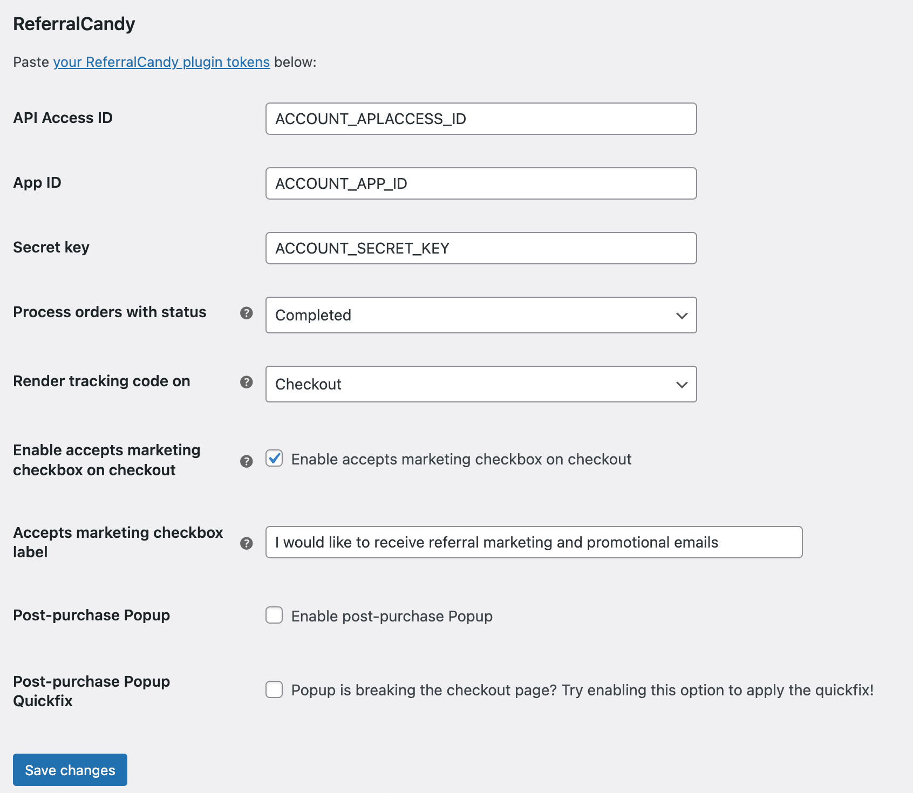

# ReferralCandy for WooCommerce

This plugin automatically integrates your WooCommerce store with ReferralCandy app using ReferralCandy Advanced Integration.

# Installation 

## From your WordPress dashboard

1. Go to **Plugins > Add New**
2. Search for: `ReferralCandy`
3. Click on **Install Now** to install and activate the plugin

## From WordPress.org

1. Download the latest version zip file
3. Go to **Plugins > Add New**
4. Click on **Upload Plugin** to upload the zip file
5. Activate the plugin after the installation

## Configure

1. Go to **WooCommerce > Settings > Integration > ReferralCandy**
2. Fill-out your App ID and Secret Key. You can get them from [ReferralCandy Admin Settings > Plugin tokens](https://my.referralcandy.com/settings))
3. Click on **Save changes** and it's done!
